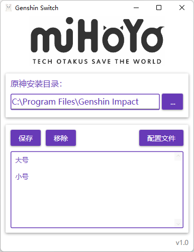

#  原神账号快速切换工具

> GenshinSwitch
> PC版国服原神账号切换工具

## 迁移

本项目分支已设为遗产级，正迁移到WinUI3框架，全新重构界面并支持米游社功能。

[此处查看main分支](https://github.com/genshin-matrix/genshin-switch/tree/main)

## 截图

## 运行环境

-  Windows7及以上
- .NET Framework 4.8

## 使用方法

1. 登录游戏账号1点击保存，比如保存为大号
2. 再登录游戏账号2点击保存，比如保存为小号
3. 双击保存的大号或小号即可自动登录

## 其他说明

- 需要管理员权限是因为游戏要管理员权限启动
- 鼠标悬浮可以看到操作提示（如要关闭自行修改配置文件）
- 选中账号右键可以使用缓启动（自动3分钟后启动，方便循环打大世界Boss材料）
- 配置文件请更新版本前自行备份

## 编译生成

所需工具：`VS2022` `7z` `dotNET_Reactor`

注意要管理员权限编译，推荐VS里编译后执行下面的参考脚本。

其中dotNET_Reactor用于编译合成为单个exe的版本。

参考：[app_build.bat](app_build.bat)

