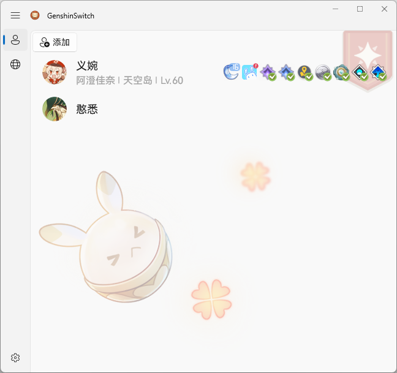
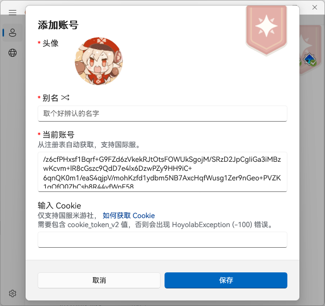
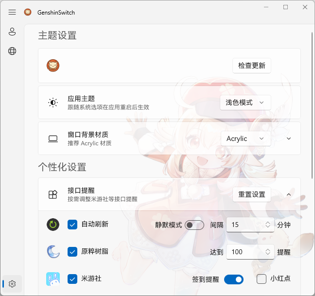

**⚠️ 由于不好维护需要管理员权限的 WinUI 应用，该项目目前停止了维护，可移步到 [Fischless](https://github.com/GenshinMatrix/Fischless) 获得类似功能。**

# GenshinSwitch

> GenshinSwitch 2.x系列 for Windows
>
> - [x] 原神账号快速切换工具（国服／国际服）
> - [x] 米游社实时便签等接口支持（国服）

## 截图

## 使用方法

1. 登录游戏账号1点击「添加」，比如添加保存为大号
2. 再登录游戏账号2点击「添加」，比如添加保存为小号
3. 双击保存的大号或小号即可自动登录
4. 可添加Cookie支持米游社接口的实时便签提醒

## 其他说明

- 本程序的1.x系列已停止维护并转入[legacy](https://github.com/genshin-matrix/genshin-switch/tree/legacy)分支
- 需要管理员权限是因为游戏要管理员权限启动
- 选中账号右键可以使用「缓启动」（自动3分钟后启动，方便循环打大世界BOSS材料）

## 常见问题

-  若安装包无法安装，请确保你的系统已安装应用商店，安装包依赖商店架构 (MSIX)。
-  运行环境是net6.0-windows10.0.19041.0。

## 功能列表

1. 原神账号快速切换工具（国服／国际服）
2. 米游社实时便签等接口支持（国服）
3. 游戏自动静音，当游戏退出前台窗口状态时自动静音
4. 咕咕鸡接口（私有库）

## 路线图

[ROADMAP.md](ROADMAP.md)

## 许可证

[MIT License](https://github.com/genshin-matrix/genshin-switch/blob/main/LICENSE)

## 特别鸣谢

[xunkong](https://github.com/xunkong/xunkong)

